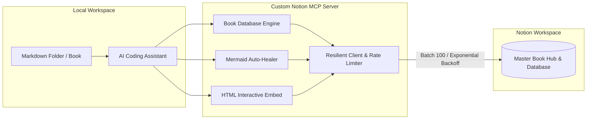

# Custom Notion MCP Server 📚⚡

[](https://opensource.org/licenses/MIT)
[](https://www.typescriptlang.org/)
[](https://modelcontextprotocol.io/)
[](https://developers.notion.com/)

An enterprise-grade **Model Context Protocol (MCP)** server for Notion, engineered specifically for **AI Coding Assistants** (Google Antigravity, Claude Desktop, Cursor). It empowers AI agents to seamlessly author, translate, and publish **multi-chapter technical books**, **long-form tutorial series**, and **interactive engineering documentation** directly into Notion.

---

## 🌟 Why This Custom MCP Server?

The official Notion MCP server (`@notionhq/notion-mcp-server`) operates strictly as an OpenAPI wrapper, exposing 24 raw, low-level HTTP endpoints that require verbose JSON schemas. It lacks domain intelligence for real-world publishing workflows, resulting in rate-limiting failures, broken inline Markdown formatting, and unhandled Mermaid syntax errors.

**Custom Notion MCP Server** bridges this gap with high-level, production-ready tools:



---

## 📊 Comparison: Official vs. Custom Notion MCP Server

| Feature | Official `@notionhq/notion-mcp-server` | Custom Notion MCP Server (This Repo) |
| :--- | :--- | :--- |
| **Book & Series Publishing** | ❌ None. Manual page-by-page creation required | ✅ **`notion_sync_book_database`**: Scans folders, creates Master Pages + Inline Databases, and generates previous/next footer navigation. |
| **Incremental Sync** | ❌ None. Repeated syncs duplicate pages | ✅ **SHA-256 Checksums**: Only updates modified chapters while safely skipping unchanged files (`Skipped (No change)`). |
| **Mermaid Diagrams** | ⚠️ Unhandled. Broken LLM syntax causes red Notion error blocks | ✅ **`MermaidSanitizer`**: Auto-quotes special characters in node labels, balances `subgraph ... end`, and applies **Graceful Fallback** to avoid red errors. |
| **Interactive HTML Embeds** | ❌ Not supported | ✅ **`notion_insert_html_embed`**: Embeds interactive HTML5 dashboards, benchmark charts, and simulators via native Notion iframe embeds. |
| **Inline Markdown Parsing** | ❌ Raw markdown (`**bold**`) is sent as plain text | ✅ **Native Tokenizer**: Converts `**bold**`, `*italic*`, `` `code` ``, `[links]` into Notion `rich_text` annotations. |
| **Character Limit Protection** | ❌ HTTP 400 error when text exceeds 2000 characters | ✅ Automatically chunks long text into segments `<= 2000` chars while preserving annotations. |
| **Rate Limit 429 & Chunking** | ❌ Crashes on rate limits or payloads with > 100 blocks | ✅ Automatically batches into 100-block chunks with 350ms delays and **Exponential Backoff** retry logic. |
| **Page Reverse Conversion** | ⚠️ Returns raw nested JSON blocks, wasting LLM tokens | ✅ Recursively reads block hierarchies and converts them back into **clean, readable Markdown**. |

---

## 📁 Repository Architecture

```text
Notion MCP/
├── server/                        # Custom Notion MCP Server source code (TypeScript)
│   ├── src/
│   │   ├── client/                # Notion Service with Auto-Retry & Rate Limiter
│   │   │   ├── notion-client.ts
│   │   │   └── rate-limiter.ts
│   │   ├── converters/            # Domain converters & sanitizers
│   │   │   ├── folder-scanner.ts  # Directory walker, frontmatter parser, SHA-256 hashing
│   │   │   ├── markdown-parser.ts # Bi-directional Markdown <-> Notion Block converter
│   │   │   ├── mermaid-sanitizer.ts # Auto-healer & graceful fallback for Mermaid
│   │   │   └── rich-text.ts       # Inline formatting & 2000-char safety tokenizer
│   │   ├── tools/                 # Registered MCP tools
│   │   │   ├── book-tools.ts      # notion_sync_book_database
│   │   │   ├── html-embed-tools.ts# notion_insert_html_embed
│   │   │   ├── markdown-tools.ts  # notion_append_markdown
│   │   │   ├── mermaid-tools.ts   # notion_insert_mermaid
│   │   │   ├── page-tools.ts      # notion_get_page_content, notion_create_page
│   │   │   └── search-tools.ts    # notion_search
│   │   └── index.ts               # MCP Server Stdio entry point
│   ├── test/                      # Comprehensive test suites
│   ├── package.json
│   ├── tsconfig.json
│   └── tsup.config.ts
├── plugins/                       # Antigravity All-in-One Plugin bundle
│   └── notion-publisher/
│       ├── plugin.json            # Plugin manifest
│       ├── mcp_config.json        # Auto-launches Custom Notion MCP Server
│       └── skills/                # Bundled skills
│           └── notion-book-publisher/
│               └── SKILL.md
├── skills/                        # Standalone Antigravity Agent Skill
│   └── notion-book-publisher/
│       └── SKILL.md               # Playbook instructing agents on book publishing
├── examples/                      # Sample books & tutorial series
│   └── llm-serving-handbook/      # 3-chapter technical handbook with Mermaid diagrams
└── references/                    # Upstream NotionHQ reference (ignored in git)
```

---

## 🛠️ MCP Tools Reference (12 Production-Ready Tools)

### 📚 Publishing & Series Orchestration
1. **`notion_sync_book_database`** *(Flagship Book Publishing Engine)*:
   - **Description**: Scans a local directory of Markdown files, computes SHA-256 checksums, creates a Master Book Hub with an Inline Database for progress tracking, and injects `[⬅️ Prev] • [🏠 TOC] • [Next ➡️]` footers. Unchanged files are safely skipped (`Skipped (No change)`).
   - **Parameters**: `folder_path` (req), `parent_page_id` (req), `book_title`, `book_icon`, `enable_footer_nav`, `force_update`.

### 📊 Databases & Structured Knowledge
2. **`notion_query_database`**:
   - **Description**: Queries records from a Notion Database with schema-aware filtering (auto-adapting to `select`, `status`, `multi_select`, `title`, `rich_text`, `number`, `checkbox`) and multi-directional sorting. Returns clean JSON records.
   - **Parameters**: `database_id` (req), `filter_property`, `filter_value`, `sort_property`, `sort_direction`, `page_size`.

3. **`notion_create_database`**:
   - **Description**: Creates arbitrary Notion databases under any parent page with full custom column schema definitions (`title`, `select`, `multi_select`, `status`, `number`, `checkbox`, `date`, `rich_text`).
   - **Parameters**: `parent_page_id` (req), `title` (req), `is_inline`, `properties_schema`.

### 📄 Pages & Content Lifecycle
4. **`notion_create_page`**:
   - **Description**: Creates standalone pages or database rows with custom titles, emoji icons, cover banners, and initial markdown content.
   - **Parameters**: `parent_id` (req), `parent_type` (`"page_id"` | `"database_id"`), `title` (req), `icon_emoji`, `cover_url`, `initial_markdown`.

5. **`notion_update_page`**:
   - **Description**: Updates page metadata (title, icon emoji, cover image), archives/deletes pages, or updates typed database row properties (`Status`, `Tags`, `Order`, `Slug`, etc.) with dynamic schema detection.
   - **Parameters**: `page_id` (req), `title`, `icon_emoji`, `cover_url`, `archived`, `properties`.

6. **`notion_get_page_content`**:
   - **Description**: Recursively extracts all child blocks from a Notion page and converts them back into clean Markdown or structured JSON.
   - **Parameters**: `page_id` (req), `format` (`"markdown"` | `"json"`), `recursive`, `max_depth`.

### 📝 Markdown & Advanced Media
7. **`notion_append_markdown`**:
   - **Description**: Parses standard Markdown and safely appends blocks in 100-block batches with 350ms delays and exponential backoff retry. Accurately tokenizes inline `**bold**`, `*italic*`, `` `code` ``, and links.
   - **Parameters**: `block_id` (req), `markdown` (req).

8. **`notion_update_page_markdown`**:
   - **Description**: Calls Notion's Enhanced Markdown API endpoint (`replace_content` or `update_content`) for direct Markdown replacement.
   - **Parameters**: `page_id` (req), `markdown` (req), `type`.

9. **`notion_insert_mermaid`**:
   - **Description**: Inserts a native Mermaid block (`language: "mermaid"`) with automatic syntax healing (auto-quotes brackets/parentheses in node labels, balances unclosed `subgraph ... end`, normalizes arrows) and graceful fallback.
   - **Parameters**: `block_id` (req), `mermaid_code` (req), `caption`.

10. **`notion_insert_html_embed`**:
    - **Description**: Inserts native sandboxed Notion iframe embeds (`type: "embed"`) for interactive HTML5 dashboards, benchmark graphs, and simulators.
    - **Parameters**: `page_id` (req), `url` (req), `caption`.

### 🧱 Blocks & Global Search
11. **`notion_delete_block`**:
    - **Description**: Deletes or archives a specific block by ID without needing to rebuild or re-upload the entire page.
    - **Parameters**: `block_id` (req).

12. **`notion_search`**:
    - **Description**: Performs global workspace-wide searches for pages and databases matching a query text.
    - **Parameters**: `query`, `filter_type` (`"page"` | `"database"`), `page_size`.

---

## 🚀 Getting Started

### 1. Installation
Clone the repository and install dependencies in the `server` directory:
```bash
git clone https://github.com/tuandung222/notion-mcp-server.git
cd notion-mcp-server/server
npm install
```

### 2. Environment Configuration
Create a `.env` file inside the `server/` directory:
```env
NOTION_API_KEY=ntn_xxxxxxxxxxxxxxxxxxxxxxxxxxxxxxxxx
NOTION_VERSION=2022-06-28
```
*(The server also supports legacy `OPENAPI_MCP_HEADERS` for backward compatibility).*

### 3. Build Bundle
```bash
npm run build
```
The compiled single-file bundle will be generated at `server/dist/index.js`.

### 4. Running Test Suites
```bash
# Run unit tests (Converters, Mermaid auto-healing, HTML Embed parser)
npm test

# Run full live Notion CRUD verification (Query, Update, Create Database, Delete Block)
npx tsx test/test-crud-suite.ts

# Run live end-to-end book sync test against Notion
npx tsx test/test-sync-book.ts
```

---

## ⚙️ MCP Client Configuration

Add this configuration to your assistant's MCP configuration file (`mcp_config.json`):

### For Google Antigravity / Claude Desktop / Cursor:
```json
{
  "mcpServers": {
    "notion-mcp-server": {
      "command": "node",
      "args": [
        "/absolute/path/to/notion-mcp-server/server/dist/index.js"
      ],
      "env": {
        "NOTION_API_KEY": "ntn_xxxxxxxxxxxxxxxxxxxxxxxxxxxxxxxxx",
        "NOTION_VERSION": "2022-06-28"
      }
    }
  }
}
```

---

## 🧠 Antigravity Agent Skill Integration

This repository includes a ready-to-use Agent Skill located at [`skills/notion-book-publisher/SKILL.md`](skills/notion-book-publisher/SKILL.md). The skill instructs AI agents on:
1. Structuring book outlines, chapter frontmatter (`title`, `order`, `tags`, `status`), and technical glossary consistency.
2. Formatting decisions: When to use **Native Mermaid Vectors** vs. **Interactive HTML Embeds**.
3. Triggering the `notion_sync_book_database` tool upon completing translations or chapters.

---

## 👤 Author & Contributions
- **Repository**: [https://github.com/tuandung222/notion-mcp-server](https://github.com/tuandung222/notion-mcp-server)
- **Author**: [tuandung222](https://github.com/tuandung222)
- **License**: MIT
