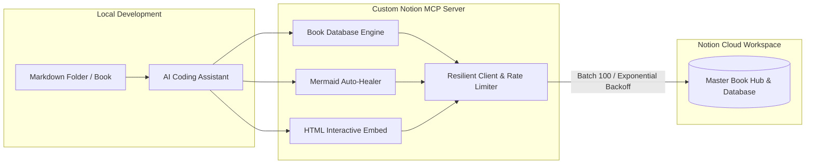

# Custom Notion MCP Server 📚⚡

[](https://opensource.org/licenses/MIT)
[](https://www.typescriptlang.org/)
[](https://modelcontextprotocol.io/)
[](https://developers.notion.com/)

An enhanced, enterprise-grade **Model Context Protocol (MCP)** server for Notion, engineered specifically for **AI Coding Assistants** (Google Antigravity, Claude Desktop, Cursor) to automate **technical book translations**, **multi-chapter tutorial series**, and **interactive engineering documentation**.

---

## 🌟 Why This Custom MCP Server?

The official Notion MCP server (`@notionhq/notion-mcp-server`) acts only as a raw OpenAPI wrapper exposing 24 low-level endpoints with heavy JSON payloads. It lacks intelligence for everyday content creation, causing rate-limiting crashes, broken Markdown formatting, and unhandled Mermaid syntax errors.

**Custom Notion MCP Server** solves all of these problems out of the box:



---

## 📊 Comparison: Official vs. Custom Notion MCP Server

| Tính năng | Official `@notionhq/notion-mcp-server` | Custom Notion MCP Server (Repo này) |
| :--- | :--- | :--- |
| **Xuất bản Sách & Series** | ❌ Không hỗ trợ, phải tạo thủ công từng trang | ✅ **`notion_sync_book_database`**: Tự quét folder, tạo Master Page + Inline Database, tự làm thanh điều hướng `[Prev/Next]`. |
| **Đồng bộ gia tăng (Incremental Sync)**| ❌ Không có, mỗi lần push là tạo trang trùng lặp | ✅ **Checksum SHA256**: Chỉ cập nhật những chương có nội dung thay đổi, tự động bỏ qua (Skipped) nếu không đổi. |
| **Mermaid Diagrams** | ⚠️ Thường xuyên bị lỗi đỏ cú pháp từ LLM | ✅ **`MermaidSanitizer`**: Tự động bọc ngoặc kép nhãn, bù thẻ `end`, nắn mũi tên, và **Graceful Fallback** chống màn hình đỏ Notion. |
| **Interactive HTML Embed** | ❌ Không hỗ trợ | ✅ **`notion_insert_html_embed`**: Nhúng dashboard, benchmark report, biểu đồ động (Chart.js/ECharts) trực tiếp qua iframe. |
| **Inline Markdown Formatting** | ❌ Gửi raw markdown `**bold**`, Notion hiển thị nguyên xi | ✅ **Inline Tokenizer**: Tự bóc tách `**bold**`, `*italic*`, `` `code` ``, `[link]` sang `rich_text` annotations chuẩn Notion. |
| **Bảo vệ Tràn Ký Tự** | ❌ Lỗi HTTP 400 nếu đoạn văn > 2000 ký tự | ✅ Tự động chia nhỏ (chunk) các đoạn văn bản dài mà vẫn bảo toàn định dạng inline. |
| **Rate Limit 429 & Giới Hạn 100 Blocks** | ❌ Crash khi dính 429 hoặc danh sách > 100 blocks | ✅ Tự động chia batch 100 blocks, nghỉ 350ms và **Exponential Backoff retry** tự phục hồi socket. |
| **Đọc Ngược Trang (Readback)** | ⚠️ Trả về JSON blocks thô, tốn token của LLM | ✅ Tự động đệ quy và dịch ngược cây blocks Notion thành **Markdown sạch sẽ**. |

---

## 📁 Cấu Trúc Dự Án (Workspace Architecture)

```text
Notion MCP/
├── server/                        # Mã nguồn Custom Notion MCP Server (TypeScript)
│   ├── src/
│   │   ├── client/                # Notion Service với Auto-Retry & Rate Limiter
│   │   │   ├── notion-client.ts
│   │   │   └── rate-limiter.ts
│   │   ├── converters/            # Các bộ chuyển đổi dữ liệu thông minh
│   │   │   ├── folder-scanner.ts  # Quét folder sách, parse frontmatter, checksum hash
│   │   │   ├── markdown-parser.ts # Chuyển đổi 2 chiều Markdown <-> Notion Blocks
│   │   │   ├── mermaid-sanitizer.ts # Auto-Healer cho sơ đồ Mermaid của LLM
│   │   │   └── rich-text.ts       # Tokenizer inline formatting annotations
│   │   ├── tools/                 # Các công cụ MCP đăng ký với AI Agent
│   │   │   ├── book-tools.ts      # notion_sync_book_database
│   │   │   ├── html-embed-tools.ts# notion_insert_html_embed
│   │   │   ├── markdown-tools.ts  # notion_append_markdown
│   │   │   ├── mermaid-tools.ts   # notion_insert_mermaid
│   │   │   ├── page-tools.ts      # notion_get_page_content, notion_create_page
│   │   │   └── search-tools.ts    # notion_search
│   │   └── index.ts               # Entry point MCP Stdio Server
│   ├── test/                      # Bộ unit test độc lập
│   ├── package.json
│   ├── tsconfig.json
│   └── tsup.config.ts
├── skills/                        # Kỹ năng Agent (Antigravity Agent Skill)
│   └── notion-book-publisher/
│       └── SKILL.md               # Playbook hướng dẫn Agent viết & xuất bản sách
├── examples/                      # Các dự án sách & series tutorial mẫu
│   └── llm-serving-handbook/      # Cẩm nang 3 chương kỹ thuật có Mermaid & Metadata
└── references/                    # Mã nguồn upstream của NotionHQ (nằm trong .gitignore)
```

---

## 🛠️ Danh Sách Công Cụ (MCP Tools Reference)

### 1. `notion_sync_book_database` *(Cốt lõi)*
- **Chức năng**: Quét thư mục Markdown cục bộ và xuất bản thành một cuốn sách hoàn chỉnh trên Notion.
- **Tham số**:
  - `folder_path` *(string, bắt buộc)*: Đường dẫn tuyệt đối tới thư mục Markdown.
  - `parent_page_id` *(string, bắt buộc)*: ID của trang Notion cha.
  - `book_title` *(string, tùy chọn)*: Tiêu đề cuốn sách (mặc định lấy tên thư mục).
  - `book_icon` *(string, tùy chọn)*: Emoji trang bìa (mặc định: `📚`).
  - `enable_footer_nav` *(boolean, mặc định: `true`)*: Tự động chèn thanh điều hướng `[⬅️ Chương trước] • [Mục lục] • [Chương sau ➡️]` ở chân mỗi trang.
  - `force_update` *(boolean, mặc định: `false`)*: Ép cập nhật lại toàn bộ dù mã băm không đổi.

### 2. `notion_insert_html_embed` *(Mới)*
- **Chức năng**: Nhúng một trang HTML/dashboard tương tác vào trang Notion qua thẻ `embed` iframe native.
- **Tham số**: `page_id`, `url` (URL công khai của file HTML), `caption`.

### 3. `notion_insert_mermaid`
- **Chức năng**: Chèn sơ đồ Mermaid vector SVG responsive với bộ tự sửa lỗi cú pháp `MermaidSanitizer`.
- **Tham số**: `block_id`, `mermaid_code`, `caption`.

### 4. `notion_append_markdown`
- **Chức năng**: Parse chuỗi Markdown và chèn vào Notion. Tự động bóc tách inline formatting sang `rich_text` annotations và chia đợt 100 blocks an toàn.

### 5. `notion_get_page_content`
- **Chức năng**: Đọc toàn bộ nội dung của một trang Notion (kể cả khối con lồng nhau) và chuyển đổi ngược thành Markdown sạch sẽ cho AI đọc.

### 6. `notion_create_page` & `notion_search`
- **Chức năng**: Tạo trang mới có icon/cover hoặc tìm kiếm nhanh trang/database trong workspace.

---

## 🚀 Cài Đặt & Chạy Thử Nghiệm

### 1. Cài đặt dependencies
```bash
cd server
npm install
```

### 2. Cấu hình biến môi trường
Tạo file `server/.env`:
```env
NOTION_API_KEY=ntn_xxxxxxxxxxxxxxxxxxxxxxxxxxxxxxxxx
NOTION_VERSION=2022-06-28
```

### 3. Build bundle
```bash
npm run build
```
File bundle độc lập sẽ được sinh tại `server/dist/index.js`.

### 4. Chạy bộ kiểm thử (Tests)
```bash
# Kiểm tra bộ chuyển đổi Markdown & RichText
npx tsx test/test-converters.ts

# Kiểm tra bộ tự sửa lỗi cú pháp Mermaid (5 test cases)
npx tsx test/test-mermaid-sanitizer.ts

# Kiểm tra bộ nhúng HTML Embed & iframe
npx tsx test/test-html-embed.ts

# Chạy nghiệm thu đồng bộ sách trực tiếp lên Notion
npx tsx test/test-sync-book.ts
```

---

## ⚙️ Cấu Hình Với AI Coding Assistants (MCP Clients)

Thêm cấu hình sau vào tệp cấu hình MCP của bạn (`mcp_config.json`):

### Dành cho Google Antigravity / Claude Desktop / Cursor:
```json
{
  "mcpServers": {
    "notion-mcp-server": {
      "command": "node",
      "args": [
        "/Users/admin/Desktop/Recents/Notion MCP/server/dist/index.js"
      ],
      "env": {
        "NOTION_API_KEY": "ntn_xxxxxxxxxxxxxxxxxxxxxxxxxxxxxxxxx",
        "NOTION_VERSION": "2022-06-28"
      }
    }
  }
}
```

---

## 🧠 Tích Hợp Antigravity Agent Skill

Dự án đi kèm Agent Skill chuẩn tại [`skills/notion-book-publisher/SKILL.md`](skills/notion-book-publisher/SKILL.md). Kỹ năng này dạy cho AI Agent:
1. Cách lập dàn ý, chia nhỏ chương mục và chuẩn hóa thuật ngữ tiếng Anh - Việt khi dịch sách.
2. Quy tắc lựa chọn: Khi nào dùng **Native Mermaid Vector**, khi nào dùng **HTML Embed Dashboard**.
3. Tự động kích hoạt công cụ `notion_sync_book_database` sau khi biên soạn xong để xuất bản lên Notion.

---

## 👤 Tác Giả & Đóng Góp
- **Repository**: [https://github.com/tuandung222/notion-mcp-server](https://github.com/tuandung222/notion-mcp-server)
- **Contributor**: [tuandung222](https://github.com/tuandung222)
- **License**: MIT
